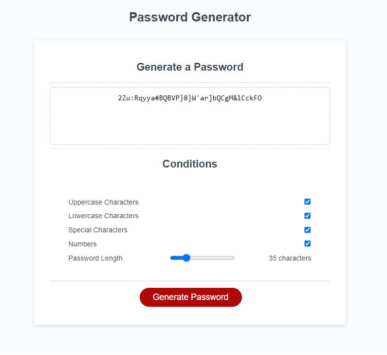
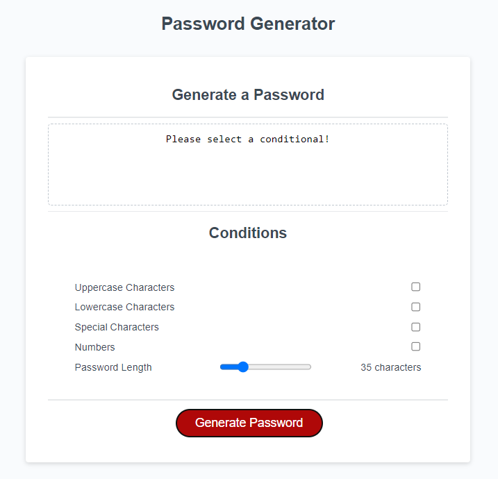

# Password-Generator

## Description

I wanted to create a website that could randomly genereate a password based on the credential settings set by the user. This would allow the generation of a completely random password everytime the button is clicked. 

Keeping you accounts secure across the internet is vital to protect your information those who wish to steal it. By building this random password generator, I will be able to secure my accounts with a randomly generated password that is hard to guess. 

I learnt a great deal about functions, and their parameters; learned how to interact with the HTML  It was also great practice for computational thinking and breaking down my problem into manageable parts.

## Installation

N/A

## Usage

When the website is loaded, you will be displayed a text box with some tickboxes underneath and a slider. Use the checkboxes to select what credentials you would like to be used when generating your password. The slider at the bottom is the amount of characters used in the password.

The site can be found [here](https://jackstockwell.github.io/password-generator/)

## Credits 

- [Mozilla web doc on Math.random()](https://developer.mozilla.org/en-US/docs/Web/JavaScript/Reference/Global_Objects/Math/random) - Used to randomly pick a number from the array.

- [w3Schools on DOM JS](https://www.w3schools.com/js/js_htmldom_methods.asp) - Used to learn the DOM and how to interact with the HTML.

- [JavaScript Tutorial](https://www.javascripttutorial.net/javascript-dom/javascript-checkbox/) - Used for the checkboxes more specifically the .checked.

- [w3 Schools tutorial on slider value](https://www.w3schools.com/howto/howto_js_rangeslider.asp) - A tutorial on how to display the value of the slider.

## License

N/A

## Features

Can randomly generate a password based upon credentials.

## Test

A randomly generated password example.

When no credentials are entered the above screen displays.
